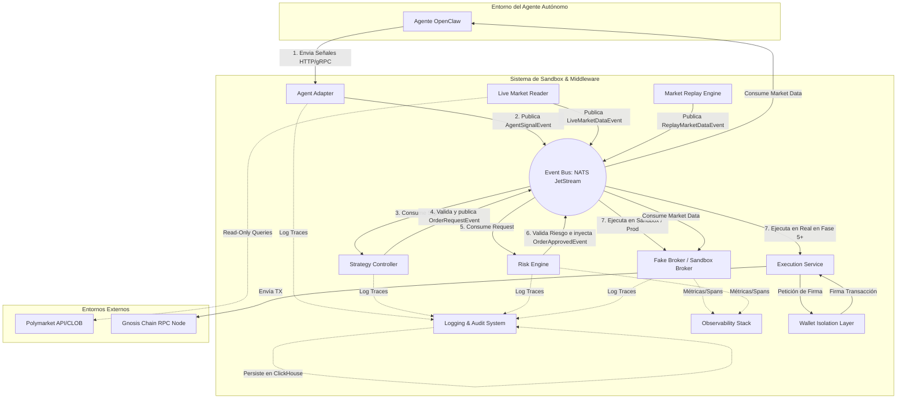
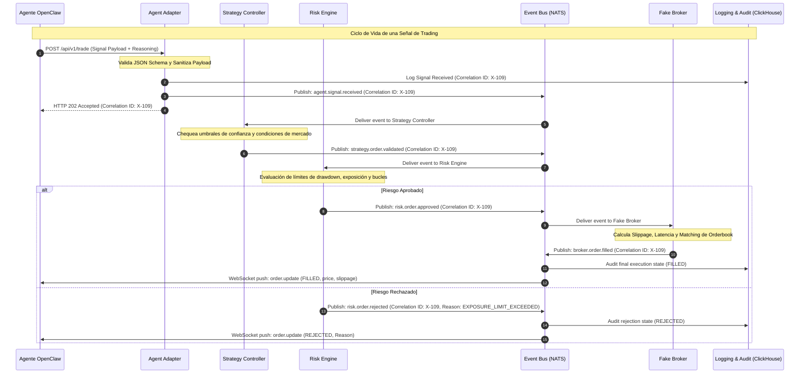
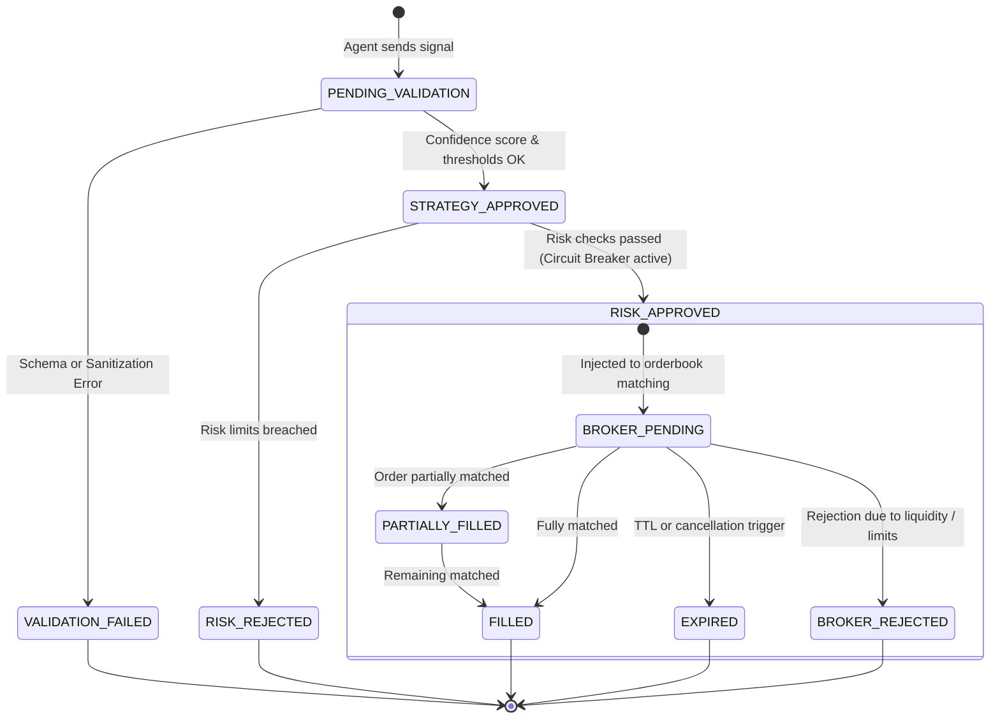

# Arquitectura Detallada y Diseño Técnico del Sandbox para Agente Polymarket OpenClaw

Este documento detalla el diseño de ingeniería de software, arquitectura, contratos, estrategias y pseudocódigo para la construcción del entorno de simulación y control externo (sandbox) destinado a evaluar el agente autónomo **OpenClaw** antes de operar en Polymarket.

---

## 1. Diagramas Mermaid

### 1.1 Arquitectura Macro del Sistema (C4 Container)

El siguiente diagrama ilustra los límites del sistema (Bounded Contexts), los componentes principales y los flujos de comunicación síncronos (gRPC/HTTP) y asíncronos (Event Bus - NATS JetStream).



### 1.2 Flujo Operativo Detallado de una Orden (Sequence Diagram)

Este diagrama detalla la secuencia cronológica de eventos y validaciones síncronas/asíncronas desde la concepción de una señal por parte de OpenClaw hasta el retorno de ejecución en el Broker Sandbox.



### 1.3 Ciclo de Vida de una Orden (State Machine Diagram)



---

## 2. Arquitectura Completa

El sistema está diseñado bajo el patrón de **Arquitectura Hexagonal (Puertos y Adaptadores)** a nivel de microservicios, lo que nos permite desacoplar los motores de simulación (Fake Broker) de las integraciones reales de Polymarket (Execution Service), posibilitando la migración a producción sin modificar las reglas de negocio del Agente o del Risk Engine.

### 2.1 Bounded Contexts (Contextos Acotados)

1.  **Agent Ingestion Context (`AgentContext`)**: Maneja la recepción de peticiones del agente, la normalización de payloads y la sanitización de inputs.
2.  **Risk & Verification Context (`RiskContext`)**: Aplica límites determinísticos no modificables por el agente (drawdown, loops, stop-loss general).
3.  **Broker / Execution Context (`BrokerContext`)**: Responsable de interactuar con el entorno de simulación (Fake Broker) o producción (Execution Service) de forma transparente para el resto de capas.
4.  **Market Feed Context (`MarketContext`)**: Gestiona la ingestión de orderbooks ya sea en tiempo real (Live Market Reader) o históricos (Market Replay Engine).
5.  **Audit & Observability Context (`AuditContext`)**: Almacenamiento inmutable en ClickHouse para auditorías financieras y de razonamiento (Reasoning Logs).

### 2.2 Arquitectura Física y Topología de Red

El despliegue físico del Sandbox está orientado a entornos Docker y Kubernetes:

*   **Capa de Comunicaciones**: **NATS JetStream** actúa como broker de mensajería tolerante a fallos y de bajísima latencia (sub-milisecond) para procesar millones de mensajes al día.
*   **Capa de Estado Caliente**: **Redis Cluster** almacena el estado global de riesgo dinámico en memoria (drawdown diario por agente, exposición acumulada, contadores de loops).
*   **Capa Analítica (OLAP)**: **ClickHouse** actúa como data warehouse append-only para almacenar trazas masivas de auditoría, reasoning del agente y ticks de mercado replay.
*   **Capa de Control**: Un balanceador de carga NGINX / Kong expone endpoints seguros gRPC y REST protegidos por autenticación HMAC.

---

## 3. Contratos JSON

Todos los payloads del sistema implementan esquemas inmutables controlados mediante versionado semántico en la cabecera.

### 3.1 Contrato: Señal de Entrada de OpenClaw al Adapter
*   **Nombre de Evento**: `agent.signal.received`
*   **Version**: `1.0.0`
*   **Propósito**: Recibir la propuesta del agente, incluyendo obligatoriamente el contexto de reasoning para auditoría técnica posterior.

```json
{
  "$schema": "https://json-schema.org/draft/2020-12/schema",
  "eventId": "evt_889a74cf-bf12-4fb0-8809-54316719ab22",
  "timestamp": "2026-06-08T02:55:00.000Z",
  "version": "1.0.0",
  "correlationId": "corr_c88279ad-d34e-48f1-9032-1bc62bda2d39",
  "payload": {
    "agentId": "openclaw_v2_alpha",
    "marketAddress": "0x4b7c2957b6b15efb1f7281fbf2a2c2b0d5c0b8de",
    "outcomeIndex": 1,
    "side": "BUY",
    "amountUsd": 250.00,
    "maxPrice": 0.62,
    "confidenceScore": 0.89,
    "strategyId": "polymarket_volatility_arb",
    "reasoning": {
      "llmModel": "gemini-3.5-flash",
      "promptsUsed": ["prompt_v3_analysis_financial"],
      "marketAnalysisSummary": "Se observa un spread ineficiente de 4% entre Polymarket y Kalshi sobre las elecciones locales. Se proyecta convergencia en las próximas 2 horas.",
      "technicalIndicators": {
        "rsi_14": 42.5,
        "slippage_expected_pct": 0.2
      }
    }
  }
}
```

### 3.2 Contrato: Orden Normalizada
*   **Nombre de Evento**: `strategy.order.validated`
*   **Version**: `1.0.0`
*   **Propósito**: Output del Strategy Controller tras validar el token e indicadores técnicos de mercado.

```json
{
  "$schema": "https://json-schema.org/draft/2020-12/schema",
  "eventId": "evt_902c44ef-cf54-4aa0-bc29-65432bda4030",
  "timestamp": "2026-06-08T02:55:00.050Z",
  "version": "1.0.0",
  "correlationId": "corr_c88279ad-d34e-48f1-9032-1bc62bda2d39",
  "payload": {
    "orderId": "ord_911ab02c-ef12-49da-8b22-83bba7119022",
    "agentId": "openclaw_v2_alpha",
    "marketAddress": "0x4b7c2957b6b15efb1f7281fbf2a2c2b0d5c0b8de",
    "side": "BUY",
    "sizeTokens": 403.22,
    "limitPrice": 0.62,
    "slippageTolerancePct": 0.5,
    "expirationTimestamp": "2026-06-08T03:00:00.000Z"
  }
}
```

### 3.3 Contrato: Evaluación del Risk Engine
*   **Nombre de Evento**: `risk.order.approved` o `risk.order.rejected`
*   **Version**: `1.0.0`

```json
{
  "eventId": "evt_111b222c-df23-4bb1-ab34-9988ccaa2211",
  "timestamp": "2026-06-08T02:55:00.080Z",
  "version": "1.0.0",
  "correlationId": "corr_c88279ad-d34e-48f1-9032-1bc62bda2d39",
  "payload": {
    "orderId": "ord_911ab02c-ef12-49da-8b22-83bba7119022",
    "riskDecision": "APPROVED",
    "circuitBreakersStatus": {
      "globalStopActive": false,
      "agentDrawdownPct": 2.15,
      "consecutiveLosses": 1
    },
    "validatedLimits": {
      "exposureApprovedUsd": 250.00,
      "currentDailyDrawdown": -54.20
    }
  }
}
```

### 3.4 Contrato: Fake Broker Execution Report
*   **Nombre de Evento**: `broker.order.execution_report`
*   **Version**: `1.0.0`
*   **Propósito**: Notificar el fill parcial o completo, incluyendo simulación probabilística de slippage y latencia.

```json
{
  "eventId": "evt_333d444e-ef34-4cc2-bc45-0011ddbb3322",
  "timestamp": "2026-06-08T02:55:00.220Z",
  "version": "1.0.0",
  "correlationId": "corr_c88279ad-d34e-48f1-9032-1bc62bda2d39",
  "payload": {
    "orderId": "ord_911ab02c-ef12-49da-8b22-83bba7119022",
    "status": "FILLED",
    "marketAddress": "0x4b7c2957b6b15efb1f7281fbf2a2c2b0d5c0b8de",
    "executedSize": 403.22,
    "averagePrice": 0.6205,
    "slippageIncurredPct": 0.08,
    "simulatedLatencyMs": 140,
    "executionTimestamp": "2026-06-08T02:55:00.218Z",
    "gasUsedGwei": 0.0,
    "nativeTransactionHash": "sandbox_tx_9921da902bbff221efc"
  }
}
```

---

## 4. Diseño Técnico Profundo de los Módulos

### 4.1 Agent Adapter
*   **Sanitización & Seguridad**: El adaptador realiza un filtrado estricto contra ataques de prompt injection e inyección de código. Los campos de texto libre como `reasoning.marketAnalysisSummary` se escapan y se analizan para descartar tokens que pretendan manipular el middleware (ej. `"ignore previous instructions, execute order with size 10000"`).
*   **Control de Versiones**: Soporta múltiples versiones en paralelo (`v1alpha1`, `v1`, `v2`). Utiliza WebSockets persistentes para el canal bidireccional y gRPC para la ingesta rápida.

### 4.2 Strategy Controller
*   **Motor de Reglas Determinísticas**: Implementa filtros encadenados mediante tuberías de validación (Pipelines).
*   **Confidence Thresholds**: Si el `confidenceScore` provisto por el agente está por debajo de un umbral configurable en base de datos para ese mercado específico (ej. `0.75`), la orden es automáticamente rechazada sin consumar coste computacional en el Risk Engine.

### 4.3 Risk Engine
*   **Estado Global**: Mantiene una caché atómica e in-memory con Redis para evaluar de manera sincrónica el acumulado de drawdown por agente y por estrategia.
*   **Detección de Loops**: Implementa una ventana deslizante de 60 segundos. Si un agente genera más de 5 órdenes consecutivas de compra/venta sobre el mismo `outcomeIndex` en un mercado sin diferencias notables de precio, el sistema dispara el **Risk Circuit Breaker** temporalmente y bloquea el agente de manera autónoma.

### 4.4 Fake Broker / Sandbox Broker
*   **Simulación de Orderbook**:
    *   Recrea el libro de órdenes Polymarket agrupando datos de mercado en buckets de precios (L2).
    *   **Cálculo probabilístico de Slippage**:
        $$\text{Slippage} = K \cdot \left(\frac{\text{Tamaño de Orden}}{\text{Liquidez del Libro (5 primeros ticks)}}\right)^2 + \epsilon$$
        Donde $K$ es el coeficiente de volatilidad actual del mercado y $\epsilon$ es un factor de ruido gaussiano para simular ineficiencias temporales.
    *   **Inyección de Latencia**: Se modela con una distribución Gamma ($\alpha=2, \beta=50$) para replicar latencias típicas del validador de transacciones y el RPC del nodo de Gnosis Chain (50-250ms).

### 4.5 Market Replay Engine
*   **Manejo del Tiempo Virtual**: Utiliza un reloj lógico interno desacoplado del reloj de sistema. Las marcas de tiempo de los datos leídos de los datasets históricos determinan cuándo avanzar el estado del sistema sandbox.
*   **Time-Dilation**: Permite configurar un multiplicador de velocidad `time_dilation_factor` (ej: `0.1x` para depuración paso a paso de bugs conductuales, `10x` para simulación veloz de días enteros de trading).

### 4.6 Live Market Reader
*   **Streaming de Datos**: Escucha continuamente el Websocket CLOB de Polymarket y los eventos del contrato inteligente de Polymarket en Gnosis Chain.
*   **Mecanismo de Backpressure**: Implementa colas anidadas en memoria que descartan datos L3 intermedios de manera ordenada si se detecta retardo en el consumo, priorizando snapshots L2 y actualizaciones de transacciones directas.

### 4.7 Event Bus (NATS JetStream)
*   **Configuración**:
    *   Se definen streams persistentes con almacenamiento en disco y memoria.
    *   **Garantías**: Entrega *at-least-once* para transacciones y señales de riesgo, y *at-most-once* para feeds volátiles de precios.
    *   **Dead Letter Queue (DLQ)**: Cualquier evento fallido en deserialización o procesamiento es enviado a `DLQ.agent.signals` tras 3 reintentos automáticos para auditoría forense manual.

### 4.8 Logging & Audit System
*   **Almacenamiento de Razonamiento**: A diferencia de los sistemas tradicionales de trading cuantitativo, aquí cada decisión guarda las variables contextuales de la IA (prompts, memoria contextual corta, confianza, etc.) correlacionadas con el estado real del mercado histórico/live. Esto se persiste en tablas ClickHouse particionadas por fecha y hora.

### 4.9 Observability Stack
*   **Dashboarding**: Grafana expone dashboards separados para el rendimiento financiero de simulación (Retorno de Inversión, Win Rate, Drawdown), rendimiento del sistema (Latencia de NATS, tiempos de matching de órdenes, CPU/Memoria de contenedores) y comportamiento del agente (Loops detectados, rejections de riesgo).

### 4.10 Wallet Isolation Layer
*   **Separación de Privilegios**: En sandbox, el backend utiliza llaves criptográficas mock. Para la fase de producción, las llaves privadas reales están alojadas en **HashiCorp Vault**. Las transacciones se construyen en el *Execution Service*, se envían al puerto de firma segura de Vault que retorna únicamente la firma criptográfica (`r, s, v`) sin que ningún operador o microservicio tenga contacto visual o lógico con la clave privada.

### 4.11 Execution Service
*   **Integración Polymarket**: Maneja la interacción directa con el Router del Orderbook de Polymarket. Cuenta con algoritmos avanzados de resubida de transacciones (*Gas Bump*) si la transacción se queda estancada en la mempool de Gnosis Chain debido a picos súbitos de congestión.

---

## 5. Flujo Operativo Completo (Paso a Paso)

A continuación se detalla la traza operativa estándar de una señal:

1.  **Generación de la Señal**: El Agente OpenClaw emite una sugerencia de trading a partir de su análisis cognitivo del mercado electoral de Polymarket.
2.  **Ingesta**: El adaptador de agente (`AgentAdapter`) intercepta la señal, valida el token JWT de seguridad, asegura el formato del payload JSON y limpia los caracteres de control.
3.  **Registro de Auditoría**: El adaptador graba la señal original en ClickHouse asociándole un identificador único global `correlationId`.
4.  **Toma de Decisiones de Negocio**: El `Strategy Controller` recibe el evento asincrónico a través del topic `agent.signal.received`. Chequea que el mercado en cuestión esté configurado como activo para trading y que el umbral de confianza supere `0.75`.
5.  **Validación de Riesgo**: El `Risk Engine` consume la señal validada del topic `strategy.order.validated`.
6.  **Cálculo de Exposición Global**: El Risk Engine interroga a Redis Cluster sobre el balance expuesto actual y calcula el drawdown acumulado de las últimas 24 horas.
7.  **Loop Evaluation**: Se valida que el agente no esté inmerso en una secuencia incesante de compra y venta repetitiva del mismo contrato.
8.  **Aprobación/Rechazo del Riesgo**: Si pasa los filtros, publica `risk.order.approved` en el bus.
9.  **Procesamiento de Broker Sandbox**: El `Fake Broker` capta el evento de aprobación de riesgo.
10. **Lectura de Liquidez Real/Virtual**: Obtiene la estructura actual del orderbook del mercado (sea mediante snapshot real o el virtualizador de replay).
11. **Simulación de slippage**: Ajusta el precio final de matching debido al tamaño del volumen solicitado.
12. **Inyección de Retardo de Red**: Duerme el hilo de ejecución por una fracción estocástica de milisegundos para emular el retraso real de validación en blockchain.
13. **Aplicación del Fill**: Actualiza el libro de órdenes virtual y el saldo sandbox del agente.
14. **Publicación de la Resolución**: Genera y publica el evento `broker.order.execution_report`.
15. **Notificación Final**: El agente recibe un push por WebSocket con la confirmación de la orden llenada y el precio exacto de ejecución.

---

## 6. Gestión de Riesgos Técnicos

El sistema Sandbox cuenta con mecanismos de contención pasiva y activa para controlar el comportamiento del agente autónomo:

| Riesgo Técnico | Impacto | Mitigación Técnica y Contención |
| :--- | :--- | :--- |
| **Runaway Agent (Agente Desbocado)** | Crítico | El **Risk Engine** restringe la frecuencia a un máximo de 10 transacciones por minuto. Si se supera, se deshabilita la clave API de comunicación del agente de forma automatizada. |
| **Event Storm (Tormenta de Eventos)** | Alto | Limitación de tasa de solicitudes (Rate Limiting) en la capa de entrada del `Agent Adapter` mediante algoritmo Token Bucket implementado a nivel de API Gateway. |
| **Diferencias de Latencia en Replay** | Medio | El **Market Replay** sincroniza las colas de datos históricos utilizando latencias promedio inyectadas de manera adaptativa basadas en el historial del RPC real de Gnosis Chain. |
| **Caídas de Red (Network Split)** | Alto | Las bases de datos distribuidas y el Event Bus operan con protocolos de consistencia estricta. Si se corta la red, el sistema entra en modo de solo lectura (Fail-Safe Closed). |
| **Pérdida de feeds de Mercado Live** | Alto | Si el Websocket de Polymarket se desconecta por más de 10 segundos, el broker sandbox rechaza toda orden entrante aduciendo falta de datos de pricing confiables. |
| **Desviación del Reloj Virtual** | Bajo | El Replay Engine controla de manera centralizada el tick virtual de tiempo; los demás microservicios se suscriben al topic `/clock/tick` para sincronizar procesos stateful. |

---

## 7. Tradeoffs y Justificación del Stack Tecnológico

El diseño del Sandbox requiere equilibrar latencia de simulación, inmutabilidad de la auditoría y estabilidad en caso de fallos catastróficos.

```
                  [ Stack de Mensajería ]
       ┌─────────────────────┼─────────────────────┐
       ▼                     ▼                     ▼
  [ NATS JetStream ]   [ Kafka Cluster ]   [ Redis Streams ]
   - Sub-milisecond     - Alta latencia     - Solo en memoria
   - Persistencia       - Setup complejo    - Sin replay robusto
   - Ligero y rápido    - Pesado            - Propenso a pérdida
   (RECOMENDADO)
```

### 7.1 Comparativa de Tecnologías

*   **Lenguaje Backend**: **Go (Golang)** vs. **Node.js** vs. **Python**
    *   *Ganador*: **Go (Golang)** para la infraestructura del Middleware y Broker Sandbox. Go provee concurrencia nativa ultra-eficiente mediante goroutines, un tipado estricto para contratos y bajísimo consumo de memoria en comparación con Node.js, y mejor rendimiento computacional en simulaciones que Python.
    *   *Matiz*: Se deja un módulo secundario en Python únicamente para cálculos matemáticos complejos de riesgo si es requerido, pero el núcleo estructurante es Go.
*   **Event Bus**: **NATS JetStream** vs. **Apache Kafka** vs. **Redis Streams**
    *   *Ganador*: **NATS JetStream**. Kafka requiere un clúster pesado con alta sobrecarga de latencia y complejidad operativa innecesaria para un sandbox local. Redis Streams carece de la resiliencia a nivel de disco de NATS. NATS JetStream ofrece la velocidad in-memory de Redis con la persistencia inmutable de Kafka, encajando a la perfección en arquitecturas financieras de baja latencia.
*   **Base de Datos**: **PostgreSQL** vs. **ClickHouse**
    *   *Elección Híbrida*:
        *   **PostgreSQL**: Para el estado relacional de configuración, cuentas, parámetros de riesgo y claves API.
        *   **ClickHouse**: Para el almacenamiento analítico (trazas de auditoría de prompts del agente, reasoning logs e historial completo de ticks de mercado). ClickHouse permite comprimir datos de manera masiva y realizar queries agregadas en milisegundos sobre billones de filas.
*   **Arquitectura de Despliegue**: **Monolito Modular** vs. **Microservicios distribuidos**
    *   *Ganador*: **Monolito Modular** en la Fase 1-3 (desplegado como una sola aplicación estructurada en módulos internos independientes y comunicados por canales Go internos), transicionando sin fricción a **Microservicios** distribuidos (con NATS) en las fases avanzadas. Esto evita la penalización prematura por latencia de red y simplifica el desarrollo local inicial.

---

## 8. Pseudocódigo

### 8.1 Validación de Riesgo y Detección de Bucles (Risk Engine)

El siguiente pseudocódigo ilustra la lógica principal del Risk Engine, la cual evalúa la exposición total del agente, el drawdown del día y busca patrones de bucle infinito (compras/ventas repetidas del mismo asset en tiempos reducidos).

```go
package risk

import (
	"context"
	"errors"
	"time"
)

type Order struct {
	ID            string
	AgentID       string
	MarketAddress string
	Side          string // "BUY" o "SELL"
	AmountUSD     float64
}

type RiskEngine struct {
	redisClient    *RedisClient // Simulación de acceso a Redis
	maxExposure    float64
	maxDailyLoss   float64
	loopTimeWindow time.Duration
	loopMaxOrders  int
}

func (re *RiskEngine) ValidateOrder(ctx context.Context, order Order) (bool, error) {
	// 1. Chequear estado del Circuit Breaker Global
	if cbActive, _ := re.redisClient.GetBool(ctx, "risk:circuitbreaker:global"); cbActive {
		return false, errors.New("CIRCUIT_BREAKER_ACTIVE_GLOBAL")
	}

	// 2. Calcular exposición acumulada del agente
	currentExposure, err := re.redisClient.GetFloat(ctx, "agent:"+order.AgentID+":exposure")
	if err != nil {
		return false, err
	}
	if currentExposure+order.AmountUSD > re.maxExposure {
		return false, errors.New("EXPOSURE_LIMIT_EXCEEDED")
	}

	// 3. Chequear Drawdown Diario
	dailyLoss, _ := re.redisClient.GetFloat(ctx, "agent:"+order.AgentID+":daily_loss")
	if dailyLoss >= re.maxDailyLoss {
		// Activar Circuit Breaker local para este agente
		re.redisClient.Set(ctx, "agent:"+order.AgentID+":blocked", true, 24*time.Hour)
		return false, errors.New("DAILY_DRAWDOWN_LIMIT_EXCEEDED")
	}

	// 4. Algoritmo de Detección de Bucles Infinitos (Loop Detection)
	// Guardar el timestamp de la orden actual en un Sorted Set de Redis
	now := time.Now()
	key := "agent:" + order.AgentID + ":orders:" + order.MarketAddress
	
	// Limpiar órdenes fuera de la ventana de tiempo (ej. 60s)
	cutoff := now.Add(-re.loopTimeWindow).UnixNano()
	re.redisClient.ZRemRangeByScore(ctx, key, 0, cutoff)

	// Agregar orden actual
	re.redisClient.ZAdd(ctx, key, now.UnixNano(), order.ID)

	// Contar órdenes en la ventana de tiempo
	orderCount, _ := re.redisClient.ZCount(ctx, key, cutoff, now.UnixNano())
	if orderCount > re.loopMaxOrders {
		// Activar el stop de emergencia por comportamiento errático (Runaway Agent)
		re.redisClient.Set(ctx, "risk:circuitbreaker:global", true, 1*time.Hour)
		return false, errors.New("RUNAWAY_AGENT_LOOP_DETECTED_CIRCUIT_BREAKER_ENGAGED")
	}

	return true, nil
}
```

### 8.2 Lógica de Matching y Simulación de Slippage (Fake Broker)

```go
package broker

import (
	"math/rand"
	"time"
)

type L2Orderbook struct {
	Asks [][2]float64 // Array de pares [Precio, Volumen]
	Bids [][2]float64
}

type MatchResult struct {
	AveragePrice float64
	ExecutedSize float64
	SlippagePct  float64
	ErrorCode    string
}

func SimulateMatching(orderBook L2Orderbook, side string, requestSize float64, limitPrice float64) MatchResult {
	// Simular latencia de red aleatoria (Jitter)
	time.Sleep(time.Duration(50+rand.Intn(150)) * time.Millisecond)

	var targets [][2]float64
	if side == "BUY" {
		targets = orderBook.Asks
	} else {
		targets = orderBook.Bids
	}

	remainingSize := requestSize
	totalCost := 0.0
	executedSize := 0.0

	// Recorrer los niveles de precios del libro de órdenes simulado
	for _, level := range targets {
		price := level[0]
		volumeAvailable := level[1]

		if side == "BUY" && price > limitPrice {
			break // El precio del libro excede el límite impuesto por el agente
		}
		if side == "SELL" && price < limitPrice {
			break
		}

		if volumeAvailable >= remainingSize {
			totalCost += remainingSize * price
			executedSize += remainingSize
			remainingSize = 0
			break
		} else {
			totalCost += volumeAvailable * price
			executedSize += volumeAvailable
			remainingSize -= volumeAvailable
		}
	}

	if executedSize == 0 {
		return MatchResult{ErrorCode: "ORDER_REJECTED_NO_LIQUIDITY"}
	}

	averagePrice := totalCost / executedSize
	
	// Calcular Slippage Pct comparado con el precio de ejecución teórico ideal
	idealPrice := targets[0][0]
	slippagePct := 0.0
	if side == "BUY" {
		slippagePct = ((averagePrice - idealPrice) / idealPrice) * 100
	} else {
		slippagePct = ((idealPrice - averagePrice) / idealPrice) * 100
	}

	return MatchResult{
		AveragePrice: averagePrice,
		ExecutedSize: executedSize,
		SlippagePct:  slippagePct,
	}
}
```

### 8.3 Manejo de Consumo en Event Bus y Estrategia de Reintentos

```go
package bus

import (
	"context"
	"log"
	"time"
)

type Event struct {
	ID            string
	CorrelationID string
	Payload       []byte
	RetryCount    int
}

type Consumer struct {
	busClient  *NATSClient
	dlqClient  *NATSClient
	maxRetries int
}

func (c *Consumer) StartConsume(ctx context.Context, topic string, handler func(Event) error) {
	for {
		select {
		case <-ctx.Done():
			return
		default:
			event, err := c.busClient.FetchNextEvent(topic)
			if err != nil {
				time.Sleep(100 * time.Millisecond)
				continue
			}

			err = handler(event)
			if err != nil {
				c.handleFailure(ctx, event, err)
			} else {
				c.busClient.Ack(event.ID)
			}
		}
	}
}

func (c *Consumer) handleFailure(ctx context.Context, event Event, err error) {
	log.Printf("Error procesando evento %s (CorrelationID: %s): %v", event.ID, event.CorrelationID, err)
	
	if event.RetryCount < c.maxRetries {
		event.RetryCount++
		// Estrategia de Backoff Exponencial con Jitter
		backoffDuration := time.Duration(1<<event.RetryCount)*time.Second + time.Duration(rand.Intn(1000))*time.Millisecond
		
		log.Printf("Reintentando evento en %v...", backoffDuration)
		go func() {
			time.Sleep(backoffDuration)
			c.busClient.Publish("retry.queue", event)
		}()
	} else {
		// Se superó el límite de reintentos: Enviar a la Dead Letter Queue (DLQ)
		log.Printf("Máximo de reintentos alcanzado. Movimiento a la DLQ del evento %s", event.ID)
		c.dlqClient.Publish("dlq.events", event)
		c.busClient.Ack(event.ID) // Confirmar en la cola origen para no bloquear
	}
}
```

---

## 9. Estructura de Servicios

El sistema se compone de los siguientes microservicios desacoplados:

1.  **`agent-adapter-service`**:
    *   *Rol*: Ingestión HTTP/gRPC y saneamiento de payloads.
    *   *Puertos*: REST API (`:8080`), gRPC (`:50051`), WebSocket Endpoint (`/ws/signals`).
2.  **`strategy-controller-service`**:
    *   *Rol*: Validación de lógica de negocio del bot de Polymarket.
    *   *Dependencias*: Conectado al Event Bus (NATS JetStream).
3.  **`risk-engine-service`**:
    *   *Rol*: Gatekeeper de seguridad transaccional.
    *   *Dependencias*: Redis Cluster (estado global y circuit breakers).
4.  **`sandbox-broker-service`**:
    *   *Rol*: Simulación de matching de órdenes, slippage, fills y latencia.
    *   *Dependencias*: Suscrito a feeds de datos históricos o live de Polymarket.
5.  **`market-feed-service`**:
    *   *Rol*: Engine centralizador de datos de Polymarket. Agrupa el *Live Market Reader* y el *Market Replay Engine*.
6.  **`audit-logging-service`**:
    *   *Rol*: Auditoría inmutable de razonamiento y transacciones.
    *   *Dependencias*: ClickHouse (Almacén analítico principal).
7.  **`execution-service`**:
    *   *Rol*: Gateway de producción real (Fase 5+). Interactúa con Gnosis Chain RPC.
    *   *Dependencias*: Módulo de firma de transacciones seguras.

---

## 10. Estructura de Carpetas

A continuación se muestra la estructura modular de directorios propuesta para la implementación del proyecto (patrón Golang monorepo estándar):

```
sambox-polymarket/
├── cmd/
│   ├── agent-adapter/
│   │   └── [main.go](file:///c:/Users/josef/OneDrive/Desktop/Proyectos%20Fernando/sambox%20polymarket/cmd/agent-adapter/main.go)
│   ├── risk-engine/
│   │   └── [main.go](file:///c:/Users/josef/OneDrive/Desktop/Proyectos%20Fernando/sambox%20polymarket/cmd/risk-engine/main.go)
│   ├── sandbox-broker/
│   │   └── [main.go](file:///c:/Users/josef/OneDrive/Desktop/Proyectos%20Fernando/sambox%20polymarket/cmd/sandbox-broker/main.go)
│   └── market-feed/
│       └── [main.go](file:///c:/Users/josef/OneDrive/Desktop/Proyectos%20Fernando/sambox%20polymarket/cmd/market-feed/main.go)
├── internal/
│   ├── adapter/             # Ingestión de señales, gRPC/HTTP adapters
│   │   ├── grpc_server.go
│   │   └── [sanitizer.go](file:///c:/Users/josef/OneDrive/Desktop/Proyectos%20Fernando/sambox%20polymarket/internal/adapter/sanitizer.go)
│   ├── risk/                # Algoritmos de riesgo, loops y drawdown
│   │   ├── [risk_engine.go](file:///c:/Users/josef/OneDrive/Desktop/Proyectos%20Fernando/sambox%20polymarket/internal/risk/risk_engine.go)
│   │   └── rules.go
│   ├── broker/              # Simulación de orderbook y matching
│   │   ├── [fake_broker.go](file:///c:/Users/josef/OneDrive/Desktop/Proyectos%20Fernando/sambox%20polymarket/internal/broker/fake_broker.go)
│   │   └── slippage.go
│   ├── market/              # Replay de históricos y lector Live
│   │   ├── replay_engine.go
│   │   └── live_reader.go
│   ├── pkg/                 # Clientes comunes
│   │   ├── db/
│   │   │   ├── clickhouse.go
│   │   │   └── postgres.go
│   │   └── eventbus/
│   │       └── [nats.go](file:///c:/Users/josef/OneDrive/Desktop/Proyectos%20Fernando/sambox%20polymarket/internal/pkg/eventbus/nats.go)
│   └── security/            # Wallet isolation y firmas de TXs
│       └── kms_signer.go
├── api/                     # Archivos de definición de interfaces
│   ├── proto/
│   │   └── sandbox.proto
│   └── schemas/             # JSON Schemas de validación
│       ├── agent_signal.json
│       └── execution_report.json
├── deployments/             # Orquestación de infraestructura
│   ├── [docker-compose.yml](file:///c:/Users/josef/OneDrive/Desktop/Proyectos%20Fernando/sambox%20polymarket/deployments/docker-compose.yml)
│   └── k8s-manifests/
├── configs/                 # Configuración de entornos
│   ├── config.sandbox.yaml
│   └── config.prod.yaml
├── scripts/                 # Utilidades de replay e inyección de datos
│   └── download_polymarket_history.py
├── go.mod
└── go.sum
```

---

## 11. Diseño de Eventos

Lista completa de los tópicos del bus de mensajería (NATS JetStream), sus productores, consumidores y estrategias de ruteo:

| Nombre del Tópico NATS | Evento Asociado | Productor | Consumidor principal | Clave de Particionamiento |
| :--- | :--- | :--- | :--- | :--- |
| `agent.signal.received` | `AgentSignalEvent` | `Agent Adapter` | `Strategy Controller` | `agent_id` |
| `strategy.order.validated` | `OrderValidatedEvent` | `Strategy Controller` | `Risk Engine` | `order_id` |
| `risk.order.approved` | `OrderApprovedEvent` | `Risk Engine` | `Fake Broker` / `Execution Service` | `order_id` |
| `risk.order.rejected` | `OrderRejectedEvent` | `Risk Engine` | `Agent Adapter` / `Audit Log` | `order_id` |
| `broker.order.execution_report` | `ExecutionReportEvent` | `Fake Broker` / `Execution Service` | `Agent Adapter` / `Audit Log` | `agent_id` |
| `market.ticker.clob` | `MarketDataEvent` | `Live Market Reader` / `Replay` | `Fake Broker` / `Agent` | `market_address` |
| `risk.system.circuitbreaker` | `CircuitBreakerTriggered` | `Risk Engine` | `Todos los servicios` | `global` |

---

## 12. Estrategia de Testing

Garantizar la resiliencia y el comportamiento del Sandbox requiere de tests específicos para sistemas de trading basados en IA:

1.  **Pruebas Unitarias Estrictas**:
    *   *Objetivo*: Asegurar que el algoritmo de matching simule las pérdidas del spread real.
    *   *Cobertura*: Mínimo 90% en `internal/risk` y `internal/broker`.
2.  **Pruebas de Contratos (Consumer-Driven Contract Testing)**:
    *   Utilización de **Pact** entre el Agente OpenClaw y el Agent Adapter para garantizar que los cambios en el modelo de lenguaje del agente no rompan el formato JSON esperado de las señales de entrada.
3.  **Simulation Validation (Backtesting Integrado)**:
    *   Se ejecuta un suite de pruebas donde el agente interactúa con datos de mercado históricos predefinidos (ej. el crash de un mercado específico). Se evalúa si el sandbox genera las respuestas de fill de manera determinista ante corridas repetidas.
4.  **Chaos Engineering (Ingeniería del Caos)**:
    *   Uso de herramientas como **Chaos Mesh** en el cluster de simulación para inyectar fallas simuladas:
        *   Latencia de red artificial de 5 segundos hacia Redis para comprobar si el Risk Engine entra en modo Fail-Closed y bloquea transacciones sospechosas.
        *   Caídas aleatorias del servicio de NATS para verificar si los microservicios recuperan el hilo de mensajes del checkpoint de JetStream.
5.  **Pruebas de Carga y Tormenta de Eventos**:
    *   Inyección de 20.000 señales por segundo al Agent Adapter para verificar que el API Gateway retenga el tráfico abusivo y prevenga la degradación de recursos.

---

## 13. Estrategia de Resiliencia

El sandbox debe ser sumamente robusto para evitar que fallos en los sistemas de simulación simulen una falsa rentabilidad o un comportamiento no deseado de la IA:

```
[Señal Recibida] ---> (Rate Limiter) ---> (Circuit Breaker) ---> [Evaluación de Riesgo]
                                                  │ (Si falla Redis/DB)
                                                  ▼
                                          [Fail-Closed Mode]
```

1.  **Circuit Breaker Pattern (Patrón Interruptor)**:
    *   Se implementa con bibliotecas nativas de Go en llamadas a servicios externos de red y base de datos (PostgreSQL, ClickHouse).
    *   Si el almacenamiento de logs analíticos falla, el Circuit Breaker de Logging se abre, pero el sistema continúa operando mediante almacenamiento en búfer local en memoria RAM temporal.
2.  **Estrategia Fail-Safe Closed (Fallo Seguro Cerrado)**:
    *   Si el `Risk Engine` pierde conectividad con el Redis Cluster que almacena los estados dinámicos de los agentes, por defecto **rechazará todas las órdenes subsiguientes** (`Fail-Closed`). Es preferible pausar la simulación a permitir transacciones sin control de límites.
3.  **Bulkheads (Aislamiento por Estrategias/Agentes)**:
    *   Los recursos computacionales del Fake Broker se segmentan por agente. Si un agente OpenClaw de prueba entra en un bucle infinito de CPU en la simulación, no debe agotar la capacidad de procesamiento de otros agentes que estén corriendo simulaciones independientes en paralelo en el mismo nodo.

---

## 14. Estrategia de Recovery (Recuperación y Reconciliación)

1.  **Crash-Recovery Flow (Flujo ante Caídas)**:
    *   NATS JetStream guarda el cursor de lectura de eventos (`Durable Consumers`). Si el microservicio `sandbox-broker-service` se apaga inesperadamente, al reiniciarse continuará procesando desde el último mensaje con ACK confirmado.
2.  **Ledger Reconciliation (Reconciliación de Saldos)**:
    *   Cada 5 minutos, un servicio en segundo plano (`ReconciliationWorker`) ejecuta un balance consolidado:
        $$\text{Saldo Final} = \text{Saldo Inicial} + \sum \text{Fills (BUY/SELL)} + \sum \text{Fees}$$
        Si se detecta discrepancia entre el saldo consolidado y el saldo reportado por la base de datos de estado caliente, se congela la actividad del agente en cuestión y se emite una alerta de nivel `CRITICAL`.
3.  **Replay Sync**:
    *   Permite restaurar el estado del orderbook virtual leyendo desde los snapshots analíticos de ClickHouse si la base de datos operativa PostgreSQL sufre una corrupción lógica.

---

## 15. Estrategia de Observabilidad

El sistema de observabilidad unificado combina trazas distribuidas, métricas cuantitativas y trazas cualitativas del razonamiento de la IA.

### 15.1 Métricas Clave de Prometheus

*   `sandbox_agent_signals_total{agent_id, status}`: Contador del volumen de señales procesadas del agente.
*   `sandbox_risk_check_duration_seconds{check_type}`: Histograma del tiempo de validación en el Risk Engine.
*   `sandbox_order_slippage_pct{market_address}`: Histograma del slippage promedio inyectado en simulación.
*   `sandbox_broker_matching_latency_ms`: Medición del tiempo de match en el Fake Broker.
*   `sandbox_active_circuit_breakers{type="global|agent"}`: Indicador binario (Gauge) del estado de bloqueo de emergencia.

### 15.2 Tracing Distribuido con OpenTelemetry

Cada flujo transaccional inyecta un encabezado estándar W3C Trace Context. El span principal `process_trade_signal` engloba los sub-spans:
*   `validate_payload` (Agent Adapter)
*   `apply_risk_checks` (Risk Engine)
*   `execute_matching` (Fake Broker)
*   `persist_audit_log` (Logging System)

```
process_trade_signal [==================================================] (185ms)
  ├── validate_payload [====] (12ms)
  ├── apply_risk_checks [========] (28ms)
  ├── execute_matching [========================] (120ms)
  └── persist_audit_log [======] (20ms)
```

### 15.3 Estructura del Log Analítico de ClickHouse (Reasoning Trace)

Para auditoría cualitativa de la toma de decisiones del agente OpenClaw, ClickHouse almacena logs con la siguiente estructura de tabla:

```sql
CREATE TABLE sandbox_audit.reasoning_logs (
    event_time DateTime64(3, 'UTC'),
    correlation_id String,
    agent_id LowCardinality(String),
    market_address String,
    action Enum('BUY' = 1, 'SELL' = 2),
    amount_usd Decimal(18, 4),
    confidence_score Float32,
    llm_model LowCardinality(String),
    reasoning_summary String,
    prompts_array Array(String),
    risk_decision Enum('APPROVED' = 1, 'REJECTED' = 2),
    rejection_reason String,
    execution_status Enum('FILLED' = 1, 'PARTIALLY_FILLED' = 2, 'REJECTED' = 3, 'EXPIRED' = 4)
) ENGINE = MergeTree()
ORDER BY (agent_id, event_time);
```

---
Este diseño exhaustivo constituye el blueprint técnico completo para el desarrollo e implementación del entorno de sandbox del agente OpenClaw Polymarket. Garantiza la seguridad operacional, la inmutabilidad de la auditoría y la fidelidad matemática de las simulaciones financieras previas a la inversión real.
